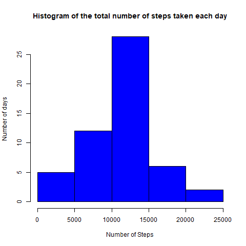
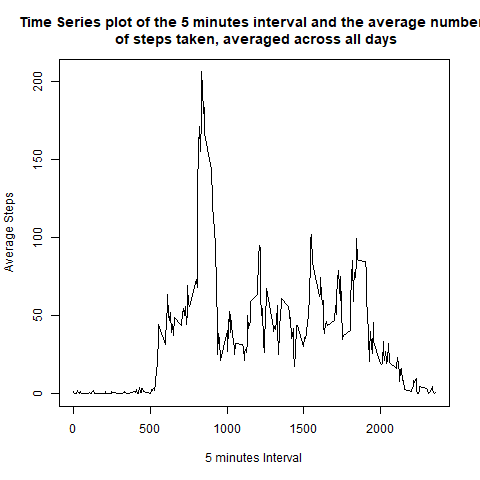
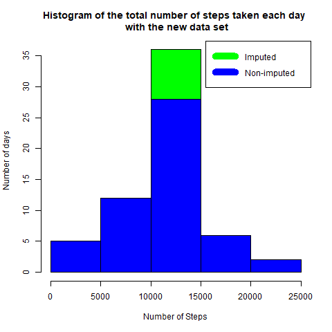
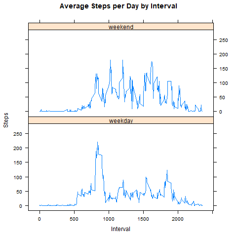

# Course Project 1. Reproducible Research. Activity Monitoring Device.

## Introduccion.

It is now possible to collect a large amount of data about personal movement using activity monitoring devices such as a Fitbit, Nike Fuelband, or Jawbone Up. These type of devices are part of the “quantified self” movement – a group of enthusiasts who take measurements about themselves regularly to improve their health, to find patterns in their behavior, or because they are tech geeks. But these data remain under-utilized both because the raw data are hard to obtain and there is a lack of statistical methods and software for processing and interpreting the data.

This assignment makes use of data from a personal activity monitoring device. This device collects data at 5 minute intervals through out the day. The data consists of two months of data from an anonymous individual collected during the months of October and November, 2012 and include the number of steps taken in 5 minute intervals each day.

The data for this assignment can be downloaded from the course web site:

- Dataset: [Activity Monitoring Data](https://d396qusza40orc.cloudfront.net/repdata%2Fdata%2Factivity.zip)

The variables included in this dataset are:

- **steps**: Number of steps taking in a 5-minute interval (missing values are coded as \color{red}{\verb|NA|}NA)
- **date**: The date on which the measurement was taken in YYYY-MM-DD format
- **interval**: Identifier for the 5-minute interval in which measurement was taken

The dataset is stored in a comma-separated-value (CSV) file and there are a total of 17,568 observations in this dataset.

# Loading and preprocessing the data

```r
# load data

url<-"https://d396qusza40orc.cloudfront.net/repdata%2Fdata%2Factivity.zip"
datzip <- 'factivity.zip'
if(!file.exists(datzip)) {
  download.file(url,datzip)
  unzip(datzip)
}
DatActivity<-read.csv("activity.csv")

# Process the data

DatActivity$date<-as.Date(DatActivity$date)
```
# What is mean total number of steps taken per day?

```r
# load library

library(dplyr)
library(lubridate)
library(lattice)

# Create a new column called day.year

DatActivity<-mutate(DatActivity,day.year=as.POSIXlt(date)$yday)
DatActivity.by.day<-group_by(DatActivity,day.year)

# Total number of steps taken per day

Total.steps.day<-summarize(DatActivity.by.day, total.steps=sum(steps,na.rm = T))

# Histogram of the total number of steps taken each day

hist(Total.steps.day$total.steps, 
     xlab = "Number of Steps", 
     ylab = "Number of days", 
     main = "Histogram of the total number of steps taken each day",
     col = "blue")
```
 
```r
# Mean and median of the total number of steps taken per day

mean.steps<-mean(Total.steps.day$total.steps)
mean.steps
```
```
## [1] 9354.23
```
```r
median.steps<-median(Total.steps.day$total.steps)
median.steps
```
```
## [1] 10395
```
The mean of the total number of steps taken per day is `9354.23` and the median is `10395`

# What is the average daily activity pattern?

```r
# Average steps by interval

DatActivity.by.interval<-group_by(DatActivity,interval)
average.steps.by.interval<-summarize(DatActivity.by.interval, average.steps=mean(steps, na.rm = T))

# Time series plot of the 5 minute interval and the average number of steps.

plot(average.steps.by.interval$interval, average.steps.by.interval$average.steps, 
     type="l",
     xlab = "5 minutes Interval", ylab = "Average Steps",
     main="Time Series plot of the 5 minutes interval and the average number \n of steps taken, averaged across all days")
```
 
```r
# 5-minute interval contains the maximum number of steps

max.step<-max(average.steps.by.interval$average.steps)
max.step
```
```
## [1] 206.1698
```
```r
interval.max.step<-average.steps.by.interval[which.max(average.steps.by.interval$average.steps),1]
interval.max.step
```
```
## # A tibble: 1 x 1
##   interval
##      <int>
## 1      835
```

The interval with most steps is `835` , the max number of steps is `206.1698`

# Imputing missing values

```r

# Total number of missing values in the dataset

total.na<-sum(is.na(DatActivity$steps))
total.na
```
```
## [1] 2304
```
the total number of missing values in the data set is `r total.na`

```r
# Strategy for filling in all of the missing values in the dataset

dimension<-dim(DatActivity)
n<-dimension[1]

fillNA <- numeric()
for (i in 1:n) {
  obs<-DatActivity[i,]
  if(is.na(obs$steps)) {
    steps<-subset(average.steps.by.interval, interval == obs$interval)$average.steps
  } else {
    steps <- obs$steps
  }
  fillNA <- c(fillNA, steps)
}

```

```r
# New data set with the missing data filled in

DatActivity.fill<-DatActivity
DatActivity.fill$steps<-fillNA

# Histogram of the total number of steps taken each day with the new dataset

DatActivity.fill.by.day<-group_by(DatActivity.fill,day.year)

Total.steps.day.fill<-summarize(DatActivity.fill.by.day, total.steps=sum(steps))

hist(Total.steps.day.fill$total.steps, 
     xlab = "Number of Steps", 
     ylab = "Number of days", 
     main = "Histogram of the total number of steps taken each day \n with the new data set",
     col = "green")

hist(Total.steps.day$total.steps, 
     col = "blue",
     add=T)

legend("topright", c("Imputed", "Non-imputed"), col=c("green", "blue"), lwd=10)
```

The histogram of the new data set with the missing data filled in is more symmetrical, and the variance is smaller.

```r
# Mean and median of the total number of steps taken per day

mean.steps.fill<-mean(Total.steps.day.fill$total.steps)
mean.steps.fill
```
```
## [1] 10766.19
```
```
median.steps.fill<-median(Total.steps.day.fill$total.steps)
median.steps.fill
```
```
## [1] 10766.19
```
The mean total number of steps taken per day is `10766.19` and the median is `10766.19`, these values differ from the estimates from the first part of the assignment

# Are there differences in activity patterns between wwekdays and weekend?

```r
# New factor variable in the dataset with two levels "weekday" and "weekend"

DatActivity.fill<-mutate(DatActivity.fill,week=weekdays(date))
DatActivity.fill$week[DatActivity.fill$week=="lunes"]<-"weekday"
DatActivity.fill$week[DatActivity.fill$week=="martes"]<-"weekday"
DatActivity.fill$week[DatActivity.fill$week=="miércoles"]<-"weekday"
DatActivity.fill$week[DatActivity.fill$week=="jueves"]<-"weekday"
DatActivity.fill$week[DatActivity.fill$week=="viernes"]<-"weekday"
DatActivity.fill$week[DatActivity.fill$week=="sábado"]<-"weekend"
DatActivity.fill$week[DatActivity.fill$week=="domingo"]<-"weekend"

# Panel plot containig a time series plot of the 5 minute interval and the average number of steps taken, averaged
# across all weekday or weekend days.

StepsTotalUnion <- aggregate(steps ~ interval + week, DatActivity.fill, mean)
xyplot(StepsTotalUnion$steps ~ StepsTotalUnion$interval|StepsTotalUnion$week, main="Average Steps per Day by Interval",xlab="Interval", ylab="Steps",layout=c(1,2), type="l")

```

